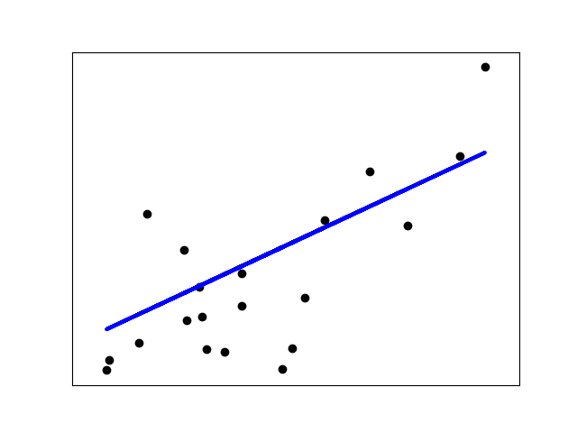

# Prediction using Linear Regression in 10 lines of code.
#### Project 1 - Udacity Data Scientist Nano Degree

Libraries used:
- pandas
- dask
- numpy
- sklearn
- matplotlib 

This exercise will walk you through a clean and simple implementation of a linear regreation to predict some values for next year of stackoverflow survey answers. All data is included as `.csv` files, as well as the code step by step, with annotations and comments.

